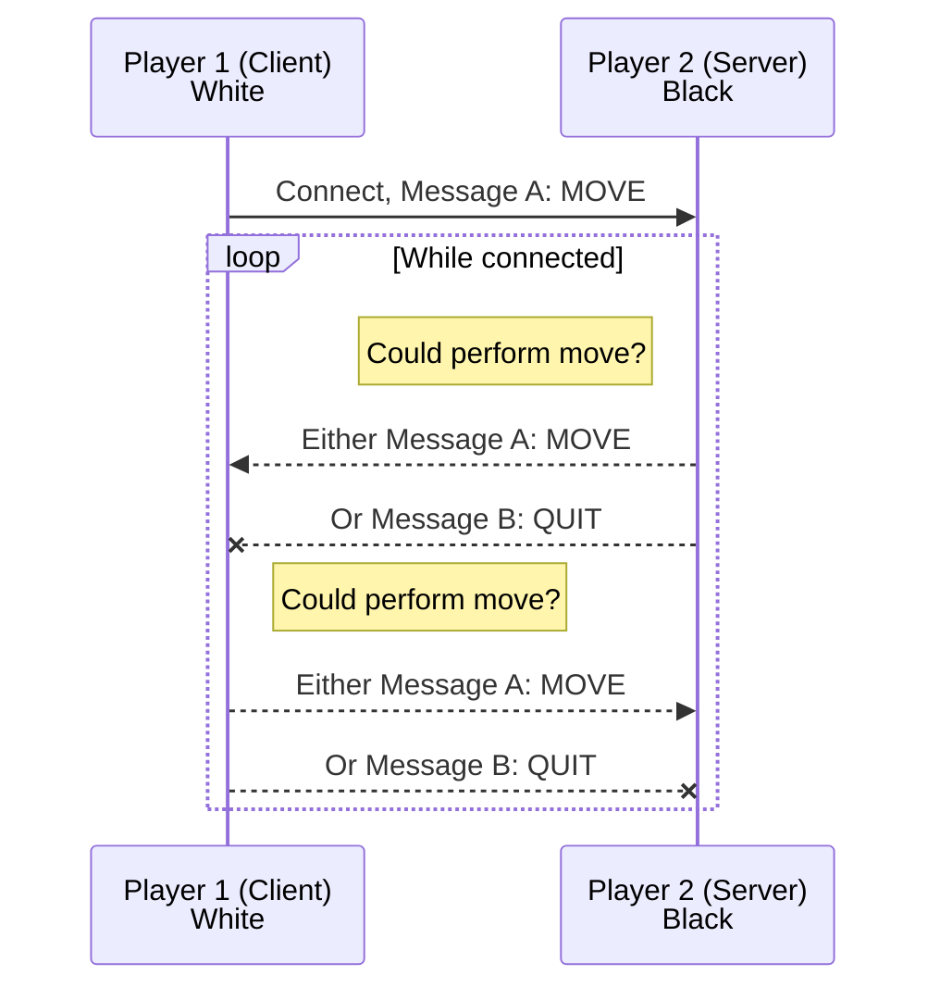

# ChessTP Specification

This document explains the Chess Transfer Protocol protocol used by the 2025 INDA PlusPlus group. It is based on TCP and consists of ASCII plaintext.

We assume that player 2 has set up a TCP server, and that player 1 is ready to connect with a TCP client. The game begins once player 1 establishes a connection with player 2. The client is always white and the server is always black. For each half turn, the active player sends Message A, consisting of a move the resulting board *after* the move according to that player's rules.

The other player should then update its local state. If it for some reason cannot update its board so that it matches the received board it should send Message B (indicating that it wishes to end the game) and must close the TCP connection. It's important that the local board is _identical_ to the received board. Otherwise it begins its half turn by sending a new move.

> **Implementation note:** If possible, the ideal way for a participant to perform a received move is to just update it's own state to exactly match the received board. This ensures that differently implemented rules are handeled gracefully.

Once either player thinks their move ends the game should must set the game state part of the MOVE message to indicate this. After a MOVE message with a game state other than `"0-0"` has been sent no more MOVE messages should be sent by either player.

At any point either party can send the QUIT message and close the TCP connection.

## Serialization

All messages consist of 128 bytes in total, sent directly in sequence.

### Message A: MOVE

Message A consists of five parts, separated by ':'
- Message identifier
- Move
- Game State
- New Board
- Padding

#### Message identifier

9 characters, the string "ChessMOVE"

#### Move

5 characters.

1. Column of start square as *capital* letter.
2. Row of start square as a 1 indexed number.
1. Column of end square as *capital* letter.
2. Row of end square as a 1 indexed number.
2. One of
    - If promotion, a FEN Notation piece letter indicating what piece the pawn was promoted to. This letter is case insensitive (i.e. the piece's color _isn't_ encoded).
    - Otherwise, '0'.

Examples:
- `"A1B50"`
- `"A7A8Q"`
- `"C7C8r"`

#### Game State

3 characters, either
- `"0-0"`: The game is on-going
- `"1-0"`: White has won
- `"0-1"`: Black has won
- `"1-1"`: Draw/stalemate

#### New Board

Dynamic amount of characters:

Boards are serialized as the "piece placement data" part of [FEN Notation](https://en.wikipedia.org/wiki/Forsyth%E2%80%93Edwards_Notation).

Examples:
- `"rnbqkbnr/pppppppp/8/8/8/8/PPPPPPPP/RNBQKBNR"`
- `"rnbqkbnr/pp1ppppp/8/2p5/4P3/8/PPPP1PPP/RNBQKBNR"`
- `"8/8/8/8/4K3/8/8/8"` (an empty board other than an white king at E4)

#### Padding

This part contains however many '0' characters as necessary to get the message to 128 bytes in total.

If `board_len` is the length of the "New Board" part (excluding the ':' separators), then the paddings length can be expressed as `128 - 9 - 1 - 3 - 1 - 5 - 1 - board_len - 1` bytes.

#### Examples

Complete examples of Message A strings.

- `"ChessMOVE:E2E40:0-0:rnbqkbnr/pppppppp/8/8/4P3/8/PPPP1PPP/RNBQKBNR:00000000000000000000000000000000000000000000000000000000000000"`
- `"ChessMOVE:A2B3Q:1-0:8/8/8/8/4K3/8/8/8:000000000000000000000000000000000000000000000000000000000000000000000000000000000000000000"` (Note: This move and board are impossible during a valid game, but the protocol doesn't explicitly dissallow that.)

### Message B: QUIT

Contains three parts, separated by ':'.

- Message identifier
- Optional Message
- Padding

#### Message identifier

9 bytes, the string `"ChessQUIT"`.

#### Optional Message

Up to 117 bytes of an ASCII plaintext message without ':'.

This may be used to specify why the player is exiting.

> If you don't want to bother with this you can just send an empty message (see the first example below).

#### Padding

This part contains however many '0' characters as necessary to get the message to 128 bytes in total.

If `message_len` is the length of the "Optional Message" part (excluding the ':' separators), then the paddings length can be expressed as `128 - 1 - message_len - 1` bytes.

The other party may display this if they wish.

#### Example

- `"ChessQUIT::000000000000000000000000000000000000000000000000000000000000000000000000000000000000000000000000000000000000000000000"`
- `"ChessQUIT:I had a panic attack:0000000000000000000000000000000000000000000000000000000000000000000000000000000000000000000000000000000000"`
